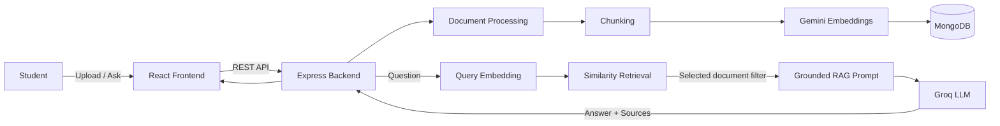

# QUORIXA

A multilingual AI-powered study assistant that lets students upload learning material and ask questions grounded strictly in their uploaded content.

Upload PDFs, images, notes, Word documents, or YouTube videos — Quorixa extracts the content, chunks it, generates embeddings, retrieves the most relevant context, and answers questions using only the selected study material.

Ask questions in **English, Telugu, or Hindi**.

> **Portfolio project:** Quorixa is a student-built portfolio application. It is not a commercial SaaS product and does not guarantee production-scale availability or uptime.

---

## Features

- **Grounded RAG chat** — answers are generated from retrieved content from your uploaded documents.
- **Multi-document study chat** — select one, several, or all documents for retrieval.
- **Single-document isolation** — when one document is selected, retrieval is restricted to that document.
- **Strict context grounding** — the answer-generation prompt instructs the model to answer only from retrieved context.
- **Source references** — each answer can show the documents used as supporting evidence.
- **Clean source UI** — sources remain collapsed by default and can be expanded without exposing raw chunk/context data.
- **Similarity scores** — retrieved source metadata preserves the backend similarity score.
- **Document library** — upload, view, search, sort, filter, rename, reprocess, and delete documents.
- **Rich uploads** — PDF, text notes, Word documents, images with OCR, and YouTube transcripts.
- **Multilingual answers** — English, Telugu, and Hindi.
- **Study-first workflow** — Library → Study opens Chat with the selected document already scoped.
- **Explicit study state** — the interface clearly indicates whether the user is studying all documents, selected documents, or none.
- **Responsive UI** — optimized for desktop and mobile layouts.
- **Light / dark / system theme**.
- **Accessible feedback** — toasts, loading states, error handling, and graceful 404 pages.

---

## Tech Stack

| Layer | Technology |
| --- | --- |
| Frontend | React 19, TypeScript, Vite |
| Styling | Tailwind CSS 4 |
| UI Icons | Lucide React |
| Routing | React Router |
| Backend | Node.js, Express, TypeScript |
| Database | MongoDB Atlas + Mongoose |
| Embeddings | Google Gemini via `@google/genai` |
| Answer Generation | Groq |
| PDF Processing | pdf-parse / pdfjs-dist |
| Word Processing | mammoth |
| OCR | Tesseract.js |
| YouTube | youtube-transcript |
| Validation | Zod |
| Testing / E2E | Puppeteer |

---

## Architecture



---

## RAG Pipeline

For every question, Quorixa follows this flow:

```text
Student question
      ↓
Query embedding using Gemini
      ↓
Similarity retrieval from stored document chunks
      ↓
Filter results by selected document IDs
      ↓
Build grounded context
      ↓
Generate answer using Groq
      ↓
Return answer + source references
      ↓
Display answer in Study Chat
```

The retrieval layer keeps the selected-document scope intact, helping prevent information from unrelated documents from entering the answer context.

---

## Source References

Sources are intentionally kept **minimal and non-intrusive** in the chat interface.

```text
AI Answer

▸ Sources · 5
```

Sources are collapsed by default.

When expanded, the user sees compact source rows containing information such as:

```text
Document icon   Chunk 9 · Document Title
```

Individual source rows can be expanded to reveal available metadata:

- Full document title
- Document type
- Similarity score

The frontend does **not** expose raw chunk/context text because the current chat API returns source metadata such as:

```text
documentId
chunkIndex
score
```

rather than the original chunk text.

Adding chunk previews in the future would require an API/backend change.

---

## Supported Document Types

| Type | MIME / Source | Processing |
| --- | --- | --- |
| PDF | `application/pdf` | PDF text extraction |
| Notes | `text/plain` | Raw text extraction |
| Word | `.docx` | mammoth |
| Images | `.png`, `.jpg`, `.jpeg`, `.webp` | Tesseract.js OCR |
| YouTube | Video URL | YouTube transcript extraction |

---

## Local Setup

### Prerequisites

- Node.js 18+
- npm
- MongoDB Atlas account
- Gemini API key
- Groq API key

### Backend

```bash
cd backend
npm install
cp .env.example .env
```

Configure the environment variables and start the backend:

```bash
npm run dev
```

Backend:

```text
http://localhost:5000
```

### Frontend

Open another terminal:

```bash
cd frontend
npm install
npm run dev
```

Frontend:

```text
http://localhost:5173
```

---

## Environment Variables

Create:

```text
backend/.env
```

| Variable | Required | Purpose |
| --- | --- | --- |
| `MONGO_URI` | Yes | MongoDB Atlas connection string |
| `GEMINI_API_KEY` | Yes | Gemini embeddings |
| `GROQ_API_KEY` | Yes | Groq answer generation |
| `PORT` | No | Backend port, default `5000` |
| `CORS_ORIGIN` | No | Allowed frontend origins |
| `RATE_LIMIT_WINDOW_MS` | No | Optional rate-limit window |
| `RATE_LIMIT_MAX` | No | Optional rate-limit maximum |

> Never commit `.env` files or API keys to GitHub.

`GROQ_API_KEY` and `GEMINI_API_KEY` remain server-side.

---

## Backend Commands

From `backend/`:

```bash
npm run dev
```

Development server with automatic reload.

```bash
npm run build
```

Compile TypeScript.

```bash
npm run start
```

Start the compiled backend.

```bash
npm run lint
```

Run ESLint.

```bash
npm run type-check
```

Run TypeScript checking.

---

## Frontend Commands

From `frontend/`:

```bash
npm run dev
```

Start Vite development server.

```bash
npm run build
```

Type-check and create production build.

```bash
npm run lint
```

Run ESLint.

---

## API Overview

All API routes are prefixed with:

```text
/api/v1
```

| Method | Route | Description |
| --- | --- | --- |
| GET | `/api/v1/health` | Service and database health |
| POST | `/api/v1/documents/upload` | Upload document |
| POST | `/api/v1/documents/upload/youtube` | Add YouTube video |
| GET | `/api/v1/library` | List documents |
| GET | `/api/v1/library/:id` | Document details |
| DELETE | `/api/v1/library/:id` | Delete document and chunks |
| PATCH | `/api/v1/library/:id/rename` | Rename document |
| PATCH | `/api/v1/library/:id/reprocess` | Reprocess document |
| POST | `/api/v1/chat/query` | Ask grounded question |

---

## Project Structure

```text
QUORIXA/
│
├── backend/
│   ├── src/
│   │   ├── controllers/
│   │   ├── models/
│   │   ├── routes/
│   │   ├── services/
│   │   ├── middleware/
│   │   └── server.ts
│   └── package.json
│
├── frontend/
│   ├── src/
│   │   ├── components/
│   │   │   ├── layout/
│   │   │   └── ui/
│   │   ├── hooks/
│   │   ├── layouts/
│   │   ├── pages/
│   │   ├── services/
│   │   ├── types/
│   │   └── utils/
│   ├── public/
│   └── package.json
│
├── e2e/
└── README.md
```

---

## Testing & Verification

### Backend

```bash
cd backend

npm run lint
npm run type-check
npm run build
```

### Frontend

```bash
cd frontend

npm run lint
npm run build
```

The current implementation has been verified with successful linting and production builds.

### End-to-End

With both backend and frontend running:

```bash
node e2e/final-e2e.js
```

The E2E flow covers:

```text
Landing
  ↓
Upload
  ↓
Library
  ↓
Study pre-selection
  ↓
Grounded Q&A
  ↓
Second document upload
  ↓
Single-document isolation
  ↓
Multi-document retrieval
  ↓
Clear selection
  ↓
Delete
  ↓
Persistence after refresh
  ↓
404 handling
```

---


## Known Limitations

- Portfolio/student project — not designed for commercial-scale traffic.
- AI provider free tiers may impose request limits.
- Chat responses are not streamed yet.
- No persistent user accounts — the application currently uses a shared document library.
- OCR quality depends on image quality and resolution.
- Large files are restricted by upload middleware limits.
- Source references currently expose metadata rather than raw retrieved chunk text.
- YouTube transcript availability depends on the source video and transcript accessibility.

---

## Project Status

**Current status: Active development / portfolio-ready prototype**

Core functionality is implemented:

- [x] Document upload
- [x] PDF processing
- [x] Word document processing
- [x] Image OCR
- [x] YouTube transcript processing
- [x] Document chunking
- [x] Gemini embeddings
- [x] Similarity retrieval
- [x] Document-scoped retrieval
- [x] Grounded AI answers
- [x] Multilingual answers
- [x] Source references
- [x] Responsive Study Chat UI
- [x] Light / dark / system theme
- [x] Library management
- [x] Reprocessing
- [x] Error handling
- [x] Production build verification

---

## License

This project is intended primarily as a personal/student portfolio project.