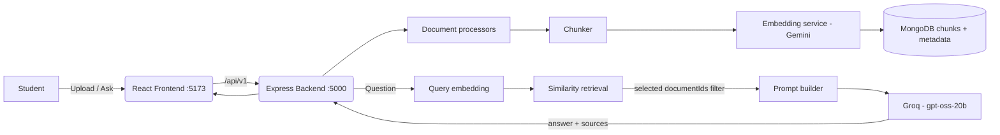

# QUORIXA

A multilingual AI-powered study assistant that lets students upload learning material and ask questions grounded only in their uploaded content.

Upload PDFs, images, notes, Word documents or YouTube videos — Quorixa extracts the text, chunks it, embeds it, and answers your questions **strictly from your own material**, with per-answer source citations. Ask in English, Telugu or Hindi.

This is a **portfolio project** — it is not a commercial SaaS application and does not guarantee production-scale availability or uptime.

---

## Features

- **Grounded RAG chat** — answers are generated from your documents only, never from the open web.
- **Multi-document study chat** — select one, several, or all documents; retrieval is scoped to your selection.
- **Single-document isolation** — when one document is selected, answers cannot leak content from other documents.
- **Source citations** — every answer lists the document and chunk used as evidence.
- **Document library** — upload, view (filename, type, size, upload date, processing status), sort, filter, rename, reprocess and multi-delete documents.
- **Rich uploads** — PDF, text notes, Word (.docx), images (OCR), and YouTube videos (transcript).
- **Multilingual answers** — request answers in English, Telugu or Hindi from Settings.
- **Study-first UX** — Library → "Study" opens Chat with that document pre-selected; "Studying: All documents / 2 of 5 documents / No documents selected" states are always explicit.
- **Polish** — light/dark/system theme, responsive layout, accessible toasts, error boundary, graceful 404.

## Tech stack

| Layer | Technology |
| --- | --- |
| Frontend | React, TypeScript, Vite, Tailwind CSS |
| Backend | Node.js, Express, TypeScript, Mongoose |
| Database | MongoDB Atlas |
| Embeddings | Gemini (`gemini-embedding-2`) via `@google/genai` |
| Answer generation | Groq (`openai/gpt-oss-20b`) |
| Document processing | pdf-parse, mammoth (docx), tesseract.js (OCR), youtube-transcript |

## Architecture



### RAG pipeline (one question)

```
Student question
   → query embedding (Gemini)
   → retrieve top-K relevant chunk embeddings from MongoDB (cosine similarity)
   → filter chunks by the currently selected document(s)
   → grounding prompt (context-only, "answer only from context")
   → openai/gpt-oss-20b via Groq
   → answer + source references (documentId, chunkIndex, score)
```

### Supported document types

| Type | MIME / source | Processing |
| --- | --- | --- |
| PDF | `application/pdf` | pdf-parse text extraction |
| Notes | `text/plain` | raw text |
| Word | `.docx` | mammoth |
| Images | `.png / .jpg / .jpeg / .webp` | tesseract.js OCR |
| YouTube | video URL | `youtube-transcript` |

## Local setup

Prerequisites: Node.js 18+ and npm.

```bash
# Backend
cd backend
npm install
cp .env.example .env     # then fill in your values (see below)
npm run dev              # http://localhost:5000

# Frontend (in a second terminal)
cd frontend
npm install
npm run dev              # http://localhost:5173
```

### Environment variables (`backend/.env`)

| Variable | Required | Purpose |
| --- | --- | --- |
| `MONGO_URI` | yes | MongoDB connection string (MongoDB Atlas) |
| `GEMINI_API_KEY` | yes | Gemini key — used for **document/query embeddings only** |
| `GROQ_API_KEY` | yes | Groq key — used for **chat answer generation** |
| `PORT` | no | Backend port (default `5000`) |
| `CORS_ORIGIN` | no | Comma-separated allowed browser origins (default: all in dev) |
| `RATE_LIMIT_WINDOW_MS` / `RATE_LIMIT_MAX` | no | Optional request rate limiting |

Never commit `.env`. `GROQ_API_KEY` stays server-side only — it is never sent to the frontend.

## Running the backend

- Dev (auto-reload): `npm run dev`
- Health check: `GET http://localhost:5000/api/v1/health`
- Convenience script: `powershell -File backend\start-backend.ps1` (starts, waits, verifies health)
- `powershell -File backend\check-status.ps1` reports backend state at any time.

## Running the frontend

- Dev: `npm run dev` in `frontend/` → http://localhost:5173
- Optional: `frontend/.env` → `VITE_API_URL=http://localhost:5000/api/v1`

## API overview

All routes are prefixed with `/api/v1`. Responses use `{ success: true, ... }`; errors use `{ success: false, message, errorCode, timestamp }`.

| Method | Route | Description |
| --- | --- | --- |
| GET | `/api/v1/health` | Service + database health |
| POST | `/api/v1/documents/upload` | Multipart upload (`file`) |
| POST | `/api/v1/documents/upload/youtube` | YouTube URL `{ url }` |
| GET | `/api/v1/library` | List documents (search, pagination, sort) |
| GET | `/api/v1/library/:id` | Document details |
| DELETE | `/api/v1/library/:id` | Delete document + its chunks |
| PATCH | `/api/v1/library/:id/rename` | Rename `{ name }` |
| PATCH | `/api/v1/library/:id/reprocess` | Reprocess (re-chunk + re-embed) |
| POST | `/api/v1/chat/query` | `{ question, documentIds?, language? }` → grounded answer + sources |

## Testing

```bash
# Backend
cd backend
npm run lint          # ESLint (0 errors)
npm run type-check    # tsc --noEmit (0 errors)
npm run build

# Frontend
cd frontend
npm run lint          # ESLint (0 errors)
npx tsc --noEmit      # TypeScript (0 errors)
npm run build

# End-to-end (real student flow, Puppeteer against a running app)
# start backend + frontend first, then:
node e2e/final-e2e.js
```

E2E steps cover: landing → upload (real PDF, request reaches backend) → library → Study pre-selection → grounded Q&A → second upload → single-doc isolation → multi-doc → clear selection → delete → persistence after refresh → graceful 404 route → no console errors.

## Screenshots

*Screenshots will be added here — landing page, upload flow, library, study chat with sources, dark mode, empty states.*

## Known limitations

- **Portfolio application** — not built for commercial-scale traffic or SLA guarantees.
- The free tiers of the AI providers impose request limits (see `backend/.env.example` for hints). Answers are generated by Groq and embeddings by Gemini.
- Chat does not stream responses yet.
- No persistent user accounts: one shared library.
- OCR quality depends on image resolution; very large files are capped at the upload middleware limit.